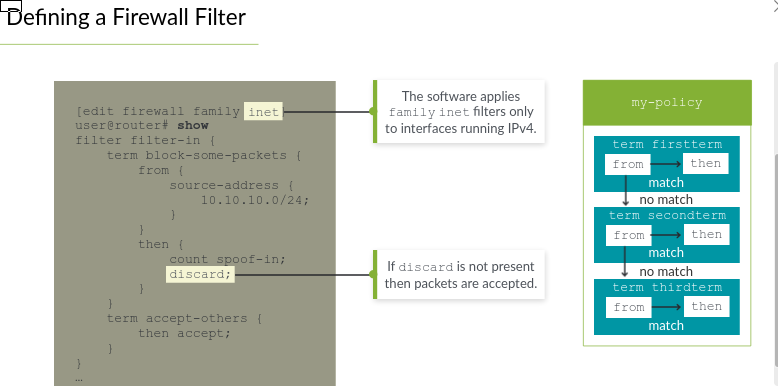
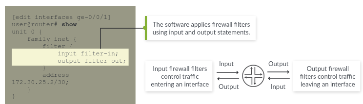
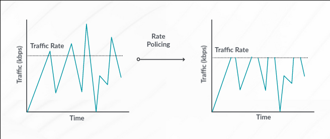
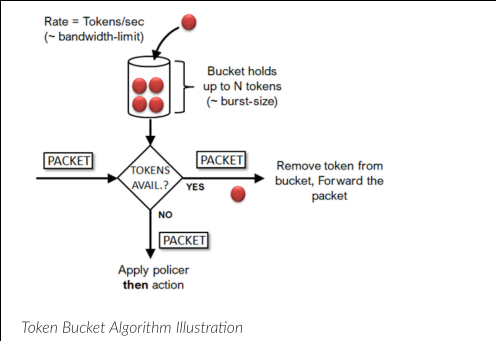

# Firewall Filters

## Objectives

- Describe the framework for firewall filters
- Explain the evaluation of firewall filters
- Identify situations where you might use firewall filters
- Create and apply a firewall filter
- Describe the operation and configuration for unicast RPF

## What is a firewall filter?

Firewall filters control traffic entering or leaving a network device. They are called Access Control Lists(ACLs) by other vendors.

They are also used to restrict certain types of traffic from traversing the network. They can also used to monitor traffic to formulate an effective security strategy.

## Types of firewall filters

### Stateless firewall filters

Junos firewall filters are *stateless*. It used to control traffic going through a Junos device. These type of filters examine each packet individually and have no concept of connections.

You must explicitly allow traffic in both directions for each connection you want to permit as the filter does not keep the state information of connections.

### Stateful firewall filters

These filters keep track of connections and enable you to specify an action to take on all packets within a flow. Stateful firewall filters only require you to permit the initial connection and then the firewall automatically permits bidirectional communications for the connection.

## Building blocks of firewall filters

Similar to Routing Policies, firewall filters contains at least one term. Each term may contain zero or more match conditions and one or more actions.

Junos requires every firewall filter to have at least one term.

The default action for a term in a firewall filter is *discard*.

### Common Match Criteria

`from` statements are used to describe match conditions within firewall filter terms. Some of match criteria include:

- most packet header fields. *All header fields may not be available due to the way firewall filters are processed*. Eg. The match condition maybe to check the ACK flag in the tcp header, but the packet that matched is a UDP packet because there was no match condition for a TCP packet first.

*Side Note*: The stateless nature of firewall filters can affect how fragmented packets are processed and is more complicated to process than with a stateful firewall filter. The first fragment should have all the Layer 4 headers but the subsequent ones will not and attempting to check L4 headers in fragmented packets produce unpredictable results.

### Match Criteria Categories

There are several text synonyms that function as match conditions. It is equivalent to one or more match conditions. Eg `tcp-established` synonym for `tcp-flag ack` or the `tcp-flag rst` match conditions.

## Firewall Filter Actions

### Terminating Actions

These actions cause the evaluation of the firewall filter to stop. Eg.

- `accept` ==> accept packet and continue processing
- `discard` ==> silently discard the packet without sending an ICMP destination unreachable message back.
- `reject` ==> discard the packet and send a ICMP destination unreachable message back. `reject` has an optional parameter than can be used to send a ICMP message with a different message code or a TCP reset instead of an ICMP.

### Flow control

`next-term` action causes Junos OS to evaluate the next term. It is useful if you want to set a policer or a DSCP value and still have the traffic evaluated by the rest of the filter.

`next filter` action does not exist for firewall filters.

### Action Modifiers

You can specify one or more action modifiers with any terminating or flow-control actions.

Junos implies an action of `accept` when you specify an action modifier but do not specify a terminating action.

`count`, `log` and `syslog` action modifiers are used to record information about packets.

`forwarding-class` and `loss-priority` are used to specify class-of-service (CoS) information.

`policer` is used to invoke a traffic policer.

## Implementing Firewall filters

It is recommended to use `commit confirmed` command when applying firewall filters. As the old adage goes, "commit confirmed has saved a lot of jobs".

### Defining a firewall filter

The filter is defined under the `[edit firewall]` hierarchy. Junos supports multiple protocol families hence you have to go to the appropriate level.

```text
[edit firewall family inet]
set filter <filter-name>
set filter <filter-name> term <term-name>
set filter <filter-name> term <term-name> from <match criteria>
set filter <filter-name> term <term-name> then <action>
```



### Applying Firewall filters

The primary purpose of firewall filters is to filter traffic entering or leaving interfaces.

Filters can be applied to all interfaces including lo0 to filter traffic destined for the system.

IPv4 filters are applied in the `[edit interfaces <interface-name> unit <unit-#> family inet filter]` hierarchy.

Apply a single input or output filter using `input <filter-name>` or `output <filter-name>`.

Apply multiple filters using `input-list` or `output-list`



## Filtering Local Traffic

Transit firewall filters act on packets flowing from one interface to another interface.

Filters can be applied to the lo0 to protect the RE from harm. The PFE filters packets before it reaches the control plane.

Junos OS does not automatically create "holes" or rules for traffic such as Routing protocol traffic and other control traffic. With that being said, any traffic should be explicitly allowed when applying filters to the lo0. The implicit silent discard, which occurs when packets don't match any defined term can cause undesirable effects.

## Policing

Policing or rate-limiting enables you to limit the amount of traffic that passes in or out of an interface. This works well with firewall filters to alleviate DoS attacks. It has some common actions such as discard and setting loss-priority level.



Firewall filters that use policing use normal match conditions to determine which traffic is subject to rate-limiting.

If a firewall term does not have a from statement but includes a policer, both input and output packets on the interface are subject to policing.

Junos OS has interface-based policers that are applied directly to a protocol family on a given logical unit without the need to apply a firewall filter. These protocol families. include l2vpns, MPLS, IPv6. The policer support varies on Junos devices.

Junos uses the token-bucket algorithm, which enforces a limit on average bandwidth while allowing bursts up a specified maximum value.



To configure rate-limits for traffic:

- *Bandwidth* (bits/sec), the number of bits per second permitted on average
- *Maximum burst size* (bytes), the total number of bytes the system allows in bursts of data that exceed the given bandwidth limit.  
**Burst size = (interface bandwidth(in bits) x allowable burst time(s))/8**

If a policer's then clause doesn't discard the packet, the system takes the remainder of the actions in the firewall filter's then clause.

In cases where the specified rate-limiting has been exceeded and both the policer and the firewall filter's *then* clauses are action modifiers, Junos uses the policer's action modifier.

Junos treats each call of a policer separately for each term that references the policer and tracks statistics separately for each term that references the policer by default.

## Show Commands

Counters keep a cumulative packet and byte count. Since counters are specific to a filter, the system keeps separate stats for counters with identical names in different filters. By default, one set of stats is kept for a counter, therefore when a filter is applied to multiple interfaces, the stats increase for the same counter.

`show firewall counter filter <filter-name> <counter-name>`

`clear firewall filter <filter-name>` to reset all counter statistics in the filter.

`clear firewall filter <filter-name> counter <counter-name>`

`show firewall log`

## Unicast Reverse Path-Forwarding Check

uRPF automates antispoofing by verifying that packets are arriving from a legitimate path. It does this by checking the source address of each packet that arrives on an interface and then compares it to the forwarding-table entry for the source address.

It is possible to combine both uRPF and firewall filters on the same interface.

Junos implements uRPF checks by downloading additional information to the PFE hence this increases PFE memory usage.

### Strict Mode (Default)

By default, the system expects to receive traffic on an interface and checks if the active route of the source address uses that same interface. If it passes the check, the packet is accepted.

### Loose Mode

In loose mode, the system just checks to ensure a valid route for the source address is in the routing table and then it accepts the packet.

In networks with a default route, there will always be a valid route to every IP address, so take into consideration when using the loose mode.

### uRPF Caveats

By default, Junos checks only the active path to a prefix and this can cause drops when there are multiple paths. In cases where there is asymmetric routing, this can drop legitimate traffic.

```text
[edit routing-options forwarding-table]
user@lab# set unicast-reverse-path feasible-paths
```

With this command, the system considers all routes it receives to a given prefix, even when they are not the active route to the destination.

It is not needed to implement uRPF on all devices in the network. It recommended to configure it on the edge device or an access layer or a device which all inbound and outbound spoofing will occur.

Enabling uRPF can impact the control plane performance, so use it where it is required. So it is strongly recommended not to enable this feature on the network core (internal) interfaces.

If a packet fails an RPF check, it is discarded by default. However, a `fail-filter` can be used to perform an action on the packet. Eg. DHCP or Bootstrap (BOOTP) traffic are denied by default by RPF. To accept this traffic, a filter has to be created to accept this packet and applied using the `fail-filter` command.

### Enabling RPF

RPF is enabled under the family protocol of an interface. Simply:

- `rpf-check`
- `rpf-check mode loose`
- `rpf-check fail-filter <filter-name>`
