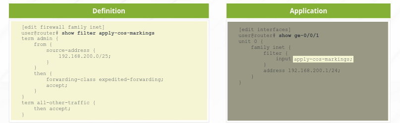

# Class of Service

## Objectives

- Describe the purpose of CoS
- Explain the various components of CoS
- Implement and verify proper operation of CoS

## What is CoS?

CoS provides mechanisms for categorizing traffic and meeting performance requirements within a network. It allows you to divide traffic into classes and offer various levels of throughput and packet loss when congestion occurs.

By default Junos treats transit traffic equally and on a first-come, first-served basis. Hence the traffic is subject to the same potential drops and delay.

CoS doesn't make a network faster nor reduces congestion. Rather, it helps to control how congestion affects different types of traffic.

Traffic shaping is the allocation of the appropriate amount of network bandwidth to every user and application on an interface.

### Components

Place traffic into different categories - forwarding classes

Treat traffic for each forwarding class in a unique manner

Mark packets with their category so other nodes in the network can handle them better.

## Meeting Performance Requirements

CoS meets a network's performance requirements by:

- Prioritizing latency-sensitive traffic such as VoIP
- Ensuring SLAs by controlling congestion
- Assigning different bandwidth for different classes of traffic.

Junos uses *Random Early Detection (RED) Algorithm* on most devices to avoid congestion.

- This selectively drops random packets before congestion becomes critical.
- It reduce the total amount traffic clients attempt to transmit through the congested link by causing the TCP sessions to go into slow start mode.

## Forwarding class

A concept used to identify traffic that should receive common treatment. Junos assigns traffic to a particular output queue based on the forwarding class.

## Loss Priority

This can be used to identify the priority for dropping packets during congestion. It can also be used to select the drop profile used in the random early detection (RED) process.

## CoS Processing

Junos OS use the forwarding class and loss priority on egress to assign traffic to queues, implement the RED algorithm and rewrite BA Headers.

### Behaviour Aggregate (BA) Classifier

Devices can be configured to set the FC and Loss priority for a packet based on the values of certain header fields such as:

- DiffServ Code Point (DSCP),
- IP Precedence,
- MPLS EXP
- IEEE 802.1p

These are usually set on the PE and indicate the categories of traffic so that the Ps does not need to recategorize the traffic.

### Multifield Classifier

Devices can also be configured to set the forwarding class and loss priority with multifield classifiers on both ingress and egress.

Multifield Classifiers are configured using firewall filters. This enables selection of packets based on all the options of a firewall filter and then setting the forwarding class and loss priority in the *then* clause. Ingress and Egress policers can also be used to modify the forwarding class and loss priority.

### Forwarding Policy

Forwarding Policy options can be used to implement CoS-based forwarding. When multiple equal-cost paths to a destination exists, CoS-based forwarding can be used to specify which of the paths to use for different classes of traffic. Also, they can be used to reset the forwarding class and loss priority for packets destined for particular prefixes.

## CoS Deployment Models

### In-the-Box Model

When deployment is limited to a single device, the packets are usually classified using a multifield classifier and then uses the classification to provide the configured service level and then forwards the packets without any BA markings (DSCP, IP precedence, etc)

### Across-the-Network Model

The PE classifies traffic using the multifield classifier as traffic enters the network and marks packets with a BA as it sends the packets into the network. The devices in the core read the BA and automatically sets the FC and loss priority without a multifield classifier.

### Advantages of Behaviour Aggregate (BA)

- Consistent CoS treatment of traffic in the network
- Simplifies the task of creating and maintaining accurate multifield classifiers on each system
- Setting the 802.1p bit as a BA enables CoS-aware Ethernet switches to provide differentiated services to the traffic.

By using BAs in network-wide CoS applications, you do not add additional overhead by setting a L3 BA.

## Multifield Classifiers

Junos applies multifield classifiers after BA hence multifield classifiers override the forwarding class and loss priority set by BA.

Multifield Classifiers are configured just like firewall filters and then placing the forwarding class and loss priority in the *then* clause. However, the default action recommended for packets that do not match the term is to not modify the FC assigned by the BA as the packet enters the interface since the MC will override the FC and loss priority set by the BA.



## Behaviour Aggregates

By default Junos does not edit the BA markers of packets as it leaves the device.

BA rules are applied by configuring a rewrite rule on the egress interface under the `[edit class-of-service interfaces]`.

Junos preserves the L3 BA fields hence when the BA is set at the edge of the network it is preserved throughout the network. However, Junos does not preserve the L2 fields and hence the MPLS EXP and IEEE 802.1p fields will have to be set each time it enters a new device.

### Rewrite Rules

To apply the default IP Precedence markings:

```text
[edit class-of-service interfaces]
set <interface-name> unit <logical-unit-number>
set rewrite-rules inet-precedence default
```

Rewrite rules can be applied at both Layer 2 and Layer 3.

You cannot apply both IP Precedence and DSCP rules to the same packets because they use the same bits in the IP header.

### Classifiers

When PEs rewrite the BA headers, the Ps can be configured to read those markers and make decisions. The BA classifier is applied to the ingress interface.

```text
[edit class-of-service interfaces]
set <interface-name> unit <logical-unit-number>
set classifiers inet-precedence default
```

Classifiers can be applied at both Layer 2 and Layer 3.

### Custom Classifiers

The default BA rewrite rules and classifiers ensures that output queues 0 - 3 maps correctly to their corresponding forwarding class.

Use a custom classifiers to map forwarding classes to more than the default queues 0 - 3. Use custom classifiers to use non-default bit patterns for the CoS header fields.

If you apply custom classifiers and rewrite rules, you must apply these rules to all devices within network to ensure consistent classification.

## Policers

Policers allow limitation of certain traffic to a specific bandwidth limit and burst size. Junos allows to configure certain FC or loss priority to the traffic exceeding the configured limits.

## Queuing

When traffic reaches the outbound interface, the system puts each traffic associated in each FC in its own queue.

By default, Junos puts traffic associated with network control (NC) in queue 3 and then all other traffic in best effort (BE) in queue 0. To forward traffic using the other queues, classifiers must be configured.

After the traffic has been placed in their queues, a scheduler defines how an interface should process the traffic in each queue.

## Defining Forwarding classes

The names of the forwarding class can be changed but Junos maintains a mapping of the class to the queue.

```text
[edit class-of-service]
set forwarding-class queue 0 <any-name>
```

To show FC and their queues: ```show class-of-service forwarding-class```

## Scheduling Overview

A scheduler contains parameters that describe how to service a queue. A scheduler is associated with a FC and queue through a schedular map. The following are components of a scheduler:

- **Priority:** Define the order in which packets should be transmitted. Junos typically transmits packets from FC or queues with a higher priority.
- **Transmission Rate:** controls how much bandwidth the traffic associated with a given forwarding class can consume.
- **Buffer Size:** determines the size of each queue.
- **RED Configuration:** as the buffer fills, the likelihood that RED algorithm will drop packets increases.

## Queue Priority

Priority scheduling determines the order in which an output interface transmits traffic from queues. It also ensures that queues containing important traffic receive better access to outgoing interface.

## Defining Schedulers

```text
[edit class-of-service schedulers]
set <any-name> transmit-rate percent 40
set <any-name> buffer-size percent 40
set <any-name> priority low
```

## Defining Schedular Maps

```text
[edit class-of-service scheduler-maps]
user@router# show
sched-map-example {
    forwarding-class best-effort scheduler sched-BE;
    forwarding-class expedited-forwarding scheduler sched-EF;
    forwarding-class assured-forwarding scheduler sched-AF;
    forwarding-class network-control scheduler sched-NC;
}
```

The scheduler maps associate the scheduler with the respective queues. The maps are applied to the outbound interfaces under `[edit class-of-service interfaces]`

The scheduler map applied on a physical interface applies to all units under the interface unless it is applied to a specific unit.

```text
[edit class-of-service interfaces]
set ge-0/0/0 scheduler-map sched-map-example
set fe-* scheduler-map sched-map-example
```

## Monitoring CoS Configuration

```show class-of-service interface <interface>```

```show class-of-service forwarding-class```

```show interfaces queue <interface>```
