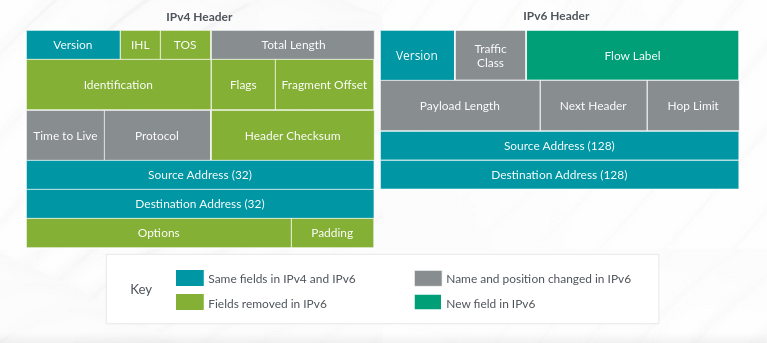

# IPv6 Fundamentals

- Describe some differences between IPv4 and IPv6
- List IPv6 address types
- Describe the IPv6 addressing format
- Enable an interface for IPv6 operation
- Configure and monitor routing for IPv6 environments
- Tunnel IPv6 traffic over an IPv4 network

IPv6 is the next generation protocol which is a redesign of the IPv4 framework, mostly due to the depletion of IPv4 address space.

## IPv4 VS IPv6

| IPv4 | IPv6 |
| ---- | ---- |
| 32-bit (4-byte); supports 4,294,967,296 | 128-bit (16-byte): supports 2^128 addresses |
| NAT can be used to extend address space limitation | Does not support NAT by design |
| DCHP or static configs to assign addresses to hosts | Hosts use Stateless Autoconfig (SLAAC) to assign IPs to themselves |
| IPSec support is optional | IPSec support is necessary |
| Options are integrated into the base header | Improved support is available for options using extension headers and overall simplification of the header format |

## Benefits of IPv6

- More efficient routing
- QoS
- Elimination of NAT requirement
- Network Layer Security with E2E IPSec
- Ease of management using SLAAC
- Improved Header format to reduce Header Overhead

## IPv6 Structure

The structure of IPv6 is a result of removing several IPv4 fields such as header length, identification, flags, fragment offset and header checksum. IPv6 headers include the following improvements over IPv4:

- Simple, more efficient processing
- Use extension headers to support additional options
- Fixed length of 40 bytes

```text
+-------------+-------------------+---------------------------------+
| Version (4) | Traffic Class (8) |        Flow Label (20)          |
+-------------+-------------------+---------------------------------+
|       Payload Length (16)       | Next Header (8) | Hop limit (8) |
+---------------------------------+---------------------------------+
|                         Source Address (128)                      |
+-------------------------------------------------------------------+
|                       Destination Address (128)                   |
+-------------------------------------------------------------------+
```

- IPv6 has a fixed length of 40bytes while IPv4 has a variable header length.
- Both IPv4 and IPv6 have Version, Source Address and Destination Addresses fields.
- Flow label is used for QoS management.
- IPv6 has Traffic Class which determines the traffic priority
- In IPv6, Time To Live field was renamed to Hop Limit.
- Next Header indicates the next encapsulated protocol.
- Payload Length indicates the size of the payload in octets.

IPv6 uses the extension headers if a packet requires fragmentation.



## IPv6 Extension Headers

IPv6 was improved with faster packet processing in mind and because it has a fixed 40 byte length, the options in the IPv4 headers are now appended to the IPv6 packet using extension headers. There are 6 extension headers that can be used:

- **Hop-by-Hop Options**: Signifies the options that need to be examined by each node in the path
- **Routing**: Provides a list of intermediate nodes that should be visited on the path to the packet's destination
- **Fragment**: Signals when a packet has been fragmented by the source. The source fragments and the destination reassembles. Intermediate routers do not fragment. Fragmentation is ALWAYS performed by the source host, using max path MTU discovery mechanism.
- **Destination**: Options examined only by the destination node, and capable of appearing twice in a packet.
- **Authentication Header**: Used with IPSec to verify authenticity of a packet
- **Encrypted Security Payload**: Used with IPSec and carries encrypted data for secure communication

## IPv6 Addressing

IPv6 uses 128 bit address which supports 2^128 addresses

### Types of IPv6 Address

- **Unicast**: A unique address that identifies an interface or node. A packet with a unicast address travels to only the interface identified.
- **Multicast**: An identifier for a group of IPv6 interfaces that might belong a different nodes. A packet with the multicast address as destination travels to all the interfaces in the group. Support 16 different types of scope.
- **Anycast**: An identifier for a group of IPv6 interfaces that might belong to different nodes. However, a packet with an anycast address will travel to only one interface, mostly the nearest interface in the group.

### Address Notation

IPv6 address is an 128 bit address in 8 16-bit hexadecimal blocks separated by colons. It can also be abbreviated:

- 2bfc:0000:0000:0000:0217:cbff:fef8:5c85/64
- 2bfc:0:0:0:217:cbff:fef8:5c85/64  # Omit leading zeros
- 2bfc::217:cbff:fef8:5c85/64  # double colon

RFC 4291 Examples of prefixes:

- `::/128` - Unspecified
- `::1/128` - Loopback
- `FF00::/8` - Multicast
- `FE80::/10` - Local link address - Link local addresses are used for neighbor discovery, autoconfiguration and routing protocol traffic. Used within same routing domain. Automatically generated on all interfaces.
- `FEC0::/10` - Site Local addresses, routable inside a limited area. Can be used as private IPV6 addresses. Have a high probability of global uniqueness.

Recommended Prefix lengths (RFC 3177):

- Use prefix length `/48` for home networks and enterprises
Use prefix length `/47` or multiple `/48`for very large subscribers
Use prefix length `/64` when it is known that one and only one subnet is needed by design.
Use prefix length `/128` for loopback addresses and end devices

Special Address:

- `::/16` - Special addressing
- `::` - Similar to 0.0.0.0 in IPv4
- `::1` - Loopback address

## Address Scope

Unicast Addresses

- Local Scope addresses are used within the same routing domain
- Global Scope are used between routing domains

Multicast Address

These support 16 different scopes including link, site, organization. A 4-bit field in the prefix identifies the scope.

## Link Local Unicast Addresses

- Guaranteed to be unique only on an individual link due to common prefix FE80:0:0:0::/64
- Not routable
- Automatically generated by the interfaces configured for IPv6

Uses:

- Neighbor discovery
- Autoconfiguration
- Routing protocol traffic

```text
+------------+-------------------------+-----------------------------------+
| 1111111010 |     0000...0000         |          Interface ID             |
+------------+-------------------------+-----------------------------------+
<-----------><------------------------><----------------------------------->
    Prefix            Zero                       Interface Identifier
   (10 bits)       (54 bits)                         (64 bits)
```

## Global Unicast Address

These are unique address like public addresses that are routable over the internet.

They are identified by various fields:

- **Format Prefix (FP)**: Binary prefix 001 (2000::/3) is present in the first 3 bits as an identifier that this is an aggreable global unicast address space.
- **Global Routing Prefix**: 45 bits reserved hierarchical address allocation. Provides highest level of address summarization.
- **Subnet Identifier (SID)**: 16 bits reserved for loThecal assignment to a link. Provides subnetting capability within a site.
- **Interface Identifier (ID)**: Last 64 bits reserved for the interface ID. Allowing for easy autoconfiguration of a host on a network using IEEE EUI64: MAC Address(48bits) with 0xFFFE in the middle.

```text
<------Public topology------><-Site-><----Interface identifier---->
+----+-----------------------+-------+----------------------------+
| FP | Global Routing Prefix |  SID  |        Interface ID        |
+-3b-+--------45b------------+--16b--+-----------64b--------------+
```

## Stateless Autoconfiguration

A device sends a **Router Solicitation (RS)** request and the router responds or sends a **Router Advertisement (RA) Message**. The RA can include IPv6 prefixes, MTU and specific routes to the router, whether to perform autoconfiguration and the duration for which an address is valid. The RS is sent to discover the presence and properties of on-link routers.

## Neighbor Discovery (ND)

Process of tracking reachability status for neighbors in a local link. A neighbor is considered reachable when there's a recent confirmation that the neighbor received or processed IP traffic or Neighbor Solicitation requests. ND is optional.

## Stateful Autoconfiguration

1. IPv6 hosts generates a link-local address from their MAC addresses
2. The hosts broadcasts Router Solicitation (RS) messages using the link local as source address
3. The IPv6 router responds to the RS with a Router Advertisement (RA) which contains a prefix list.
4. The host uses the prefixes to perform autoconfiguration.

DHCPv6 (RFC 3315) can also be used.

## IPv6 Multicast Address

- Identifier for a set of interfaces that typically belong to different nodes.
- Only members of the group process the incoming packet
- Routable and more efficient that broadcasts
- ICMPv6 is used for multicast group management to optimize multicast traffic (Multicast Listener Discovery - MLD)

Multicast address are identified by high order byte FF or 1111 1111:

```text
+-----------+-------+-------+----------+
|   8bits   | 4bits | 4bits | 112 bits |
+-----------+-------+-------+----------+
| 1111 1111 | Flags | Scope | Group ID |
+-----------+-------+-------+----------+
```

There are 3 types of Multicast Addresses (RFC 4291):

- **Solicited-Node**: Neighbor Solicitation (NS) Messages
- **All-Nodes**: Router Advertisement (RA) Messages
- **All-Routers**: Router Solicitation (RS) Messages

## IPv6 Anycast Address (RFC 2526)

An identifier for a set of interfaces, usually belonging to separate nodes but only one responds to the packet mostly the closest interface determined by the Routing protocol. It can be used to enable nodes access one of a collection of servers providing a well-known service eg. 8.8.8.8 . It can also be used to force traffic through a specific ISP.

## Interface Configuration

To configure:  
`set interfaces ge-0/0/0.0 family inet6 address fc00::2003:2/64`

To verify:  
`show interfaces terse ge-0/0/0`

## Routing Table

`show route table inet6`

## Displaying neighbor list

You may have to ping the neighbor before it is discovered.

`show ipv6 neighbors`

## Static Route

```text
[edit routing-options]
user@R1# show
rib inet6.0 {
    static {
        route 0::/0 {
            next-hop fc00:a088:3bc4:1234::2 ;
            preference 250;
        }
    }
}
```

To view the route:  
`show route table inet6.0 protocol static`

## OSPFv3

In IPv6, OSPFv3 (RFC5340) has graceful restart (RFC5781) and authentication/confidentiality (RFC4552) to provide security. The router id is the same as in IPv4 and the protocol configuration is done under [protocols ospf3] not **ospfv3** hierarchy.

Recommended to set router-id:  
`set routing-options router-id 1.1.1.1`

OSPFv3 configuration:  
`set protocols ospf3 area 0.0.0.0 interface ge-0/0/1.0`

| OSPFv2 | OSPFv3 |
|--|--|
| show ospf neighbor | show ospf3 neighbor |
| show ospf interface | show ospf3 neighbor |
| show ospf database | show ospf3 database |
| show ospf route | show ospf3 route |

## ISIS & BGP

ISIS and BGP configuration is the same in IPv6 except the ip addresses.

## Tunneling IPv6 over IPv4

This is usually done when some intermediate routers have not been upgraded to support IPv6. It is done by encapsulating the IPv6 packet within an IPv4 header.

The IPv4 header is removed after traversing the intermediate router(s) and de-encapsulate the IPv6 packet. The packet is then processed or forwarded.

Common Approaches:

- IPv4-compatible addressing
- Configured tunnels
- 6to4
- 6over4

## Case Study

GRE Tunnels are stateless. Always ensure both sides are up.

Topology:

```text
+------+ ::2      ::1 +------+              +------+ ::1      ::2 +------+
|USER A|--------------|  R1  |--------------|  R2  |--------------|USER B|
+------+    Site A    +------+   Internet   +------+    Site B    +------+
      fc00:0:0:2000::/64                          fc00:0:0:2001::/64
```

R1 Configuration:

```text
# Tunnel Creation

[edit interfaces gr-0/0/0]
unit 0 {
  tunnel {
    source 192.168.1.1;
    destination 192.168.2.1;
  }
  family inet6 {
    address fc00:0:0:1000::1/126;
  }
}

# Route Creation

[edit routing options]
rib inet6.0 {
  static {
    route fc00:0:0:2001::/64 next-hop gr-0/0/0.0;
  }
}
static {
  route 192.168.2.1/32 next hop 172.18.1.1;
}
```

R2 Configuration:

```text
## Tunnel Creation

[edit interfaces gr-0/0/0]
unit 0 {
  tunnel {
    source 192.168.2.1;
    destination 192.168.1.1;
  }
  family inet6 {
    address fc00:0:0:1000::2/126;
  }
}

### Route Creation
[edit routing options]
rib inet6.0 {
  static {
    route fc00:0:0:2000::/64 next-hop gr-0/0/0.0;
  }
}
static {
  route 192.168.1.1/32 next hop 172.18.2.1;
}
```

Verification:

- `show interfaces terse gr-0/0/0`- Tunnel verification
- `show route 192.168.2.1` - Routes installed
- `show route table inet6.0 fc00:0:0:2001::/64`
- `show interfaces gr-0/0/0.0 detail | find "traffic statistics"` - Traffic stats
