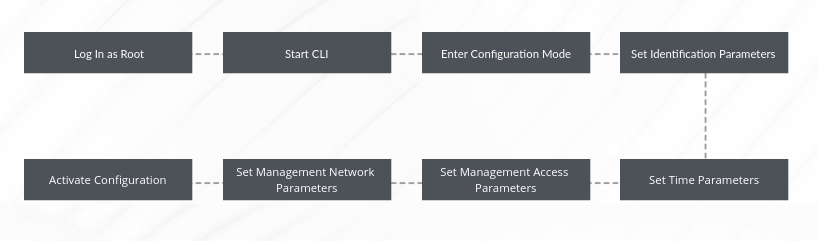
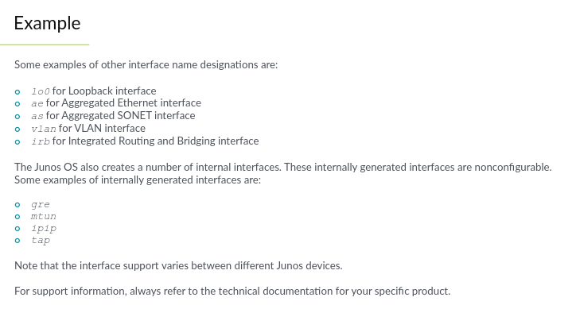
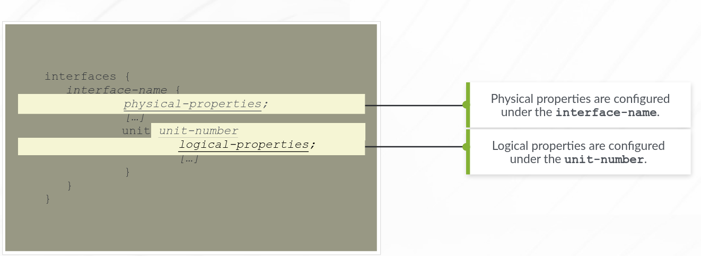

# Initial Configuration

New Devices are shipped with factory-default configs that:
- Enables access using the root account with no password
- Needs a password to be set before changes can be committed
- Includes system logging
- Contains additional configs based on the platform.

Each platform has its own factory-defaults based on their roles. Eg. EX Series are designed to operate as Layer 2 switches hence all the interfaces are configured for L2 operations right out of the box.

## Loading a factory-default config

The command `load factory-default` is used to return a device to factory default configs. You will need to set the root authentication before you can commit after loading the factory default - `set system root-authentication plain-text password`.

## Powering on

After a Junos device loses power, it automatically boots up when power is restored.

## Shutting Down Gracefully

Use the `request system halt` command to gracefully shutdown the device to ensure file system integrity. The command can be used to:
- schedule a shutdown at a particular time
- schedule a shutdown timer
- select a boot media for next boot
- send a message to all users before shutdown
- halt both Routing Engines for devices with redundant REs

## Initial Configuration Checklist

- root password. Password must not be less than 6 characters, etc.
- Hostname
- System Time (NTP)
- Remote access protocols to be used - Telnet, SSH
- Management Interface and static route for management traffic



### Log In as Root

You must use the console to log into a new device with root username and no password.  
The hostname of a new device is `Amnesiac`

### Start CLI

When you log in as root you are placed in the UNIX shell. You must go into the operational mode with the `cli` command. The UNIX shell is denoted by '%' after root.

```text
root@% cli
root>
```

### Enter Configuration Mode

Enter `configure` in the operational mode to enter the configuration mode

### Set Identification Parameters

1. Enter the system hierarchy `edit system`
2. Set hostname in the system hierarchy `set host-name router_name`
3. Set root authentication `set root-authentication plain-text password`

### Set Time Parameters

Still in the system hierarchy, set the timezone `set time-zone Africa/Accra`.  
Set the local time:
```text
[edit system]
root# run set date 202105011244.00
Sat May 1 12:44:00 UTC 2021
```

### Set Management Access Parameters

Still under the system hierarchy:
- `set services telnet`
- `set services ssh`

You can set a login message with `set login message "Login Message"`

By default the CLI session does not time out, to change this, use `set cli idle-timeout [0-100,000 mins]`. 0 means no timeout.

### Set Management Network Parameters

Using a default static route for management traffic is highly discouraged. Be specific as possible. The `no-readvertise` command can also be used to mark the route as ineligible for readvertisement through a routing policy.  
To set the ip address for management and configure a static route:

```text
[edit]
root# set interface <mgt_interface> unit 0 family inet address 10.0.1.131/27

[edit]
root# set routing-options static route 10.0.1.0/24 next-hop 10.0.1.129
```

**Note**: Static routes or any other configured routes are only available when the Junos routing process (rpd)is running. Therefore when devices boot, the rpd isn't running and the system has no routes installed. To ensure that, the management route is reachable even when the rpd fails to start properly, a **backup router** is configured. This is basically a gateway that is directly connected to the local system and on the same subnet as the management interface.

The **backup router** is configured under the system hierarchy:

```text
[edit system]
root# set backup-router 10.0.1.129 destination 10.0.15.0/24;
```

When the routing protocols start, the address of the backup router is removed from the local and forwarding tables. To keep the address, configure a static route for the destination and add the `retain` option.

### Activating the configuration

You can always check the syntax configs before committing by using the `commit check` command. Then `commit` or `commit and-quit` to activate the configs. The prompt should change after committing. eg. root@router>

### Viewing the results

Use the `show configuration` to display the hierarchical configs created by the set commands

## Rescue Configuration

The rescue config is designed to restore basic connectivity in the event of configuration problems. This is not enabled by default and it is created by the user. It must contain the root password at least.

To save the active config as rescue configuration (Done in operation mode):  
`root@router> request system configuration rescue save`

To delete the rescue configuration (Done in operation mode):  
`root@router> request system configuration rescue delete`

To load the rescue config (Configuration mode):
`rollback rescue`

**Note**: This has to be committed before it is applied.

## Interfaces

### Interface Naming

Interfaces are named according to:

- Interface media type (ge, so, at, xe etc.)
- Line card (FPC) slot number
- Interface card (PIC) number
- Port Number

Format: `interface_media-FPC_slot-PIC_slot-Port_number`. Eg. xe-1/0/1

The counting always starts at 0. Example: ge-0/2/3 = physical port 4 on a GE PIC in slot 3 on FPC 0.

There are various interfaces that don't following the naming convention.




### Management Interfaces

These are used to connect the device to a management network. They are meant to be 'out-of-band'. The names vary on each platform. Eg. fxp0 for SRX, me0 for EX

### Internal Interfaces

These are used to connect the control and forwarding planes. The names are platform-specific. Eg. fxp1 and em0.

### Network Interfaces

These are used to provide media-specific network connectivity. Eg. Ethernet, SONET, ATM, T1, DS3

### Services Interfaces

These are used to provide one/more user-configurable services such as encryption, tunneling and link services. The services can be provided through a physical interface or through software. The services interfaces provided through the physical interface card (PIC) do not have ports or media associated with them instead they have a two-letter interface type. Eg. es, gr, ip, ls, vt.

### Loopback Interfaces

Loopback interfaces provide a constant and dependable hardware-independent interface. Junos uses 'lo0' on all platforms.
You can configure a single logical unit for lo0 for each routing instance. Each logical unit associated with a routing instance can have multiple configured IP addresses.

## Logical Units

These are similar to subinterfaces. They allow you to map virtual interfaces to a physical interface.

Some encapsulations such as PPP and Cisco HDLC support only one logical unit. This logical unit number must be 0.

### Difference between Logical Unit Number vs Circuit Identifier

Logical units are logical partitions on the physical device but the circuit identifier is used to identifies the logical tunnel/circuit. It is recommended to keep the logical unit and circuit identifier the same as this aids in troubleshooting.

### Multiple Addresses

Junos does not replace the ip address of a logical interface when an address already exists when the set command is run. Instead, it adds the new address to the old address. Watch out for this when working with routing protocols.

You can use the `rename famaily inet address 10.1.1.1/32 to address 10.5.2.1/24` to 'replace' the address.

## Interface Properties



### Physical Properties

These are defined directly under the interface-name sub hierarchy. They are properties such as Speed, MTU, Link mode (duplex settings), FCS and Clocking.

### Logical Properties

The properties include Protocol family, addresses and virtual circuits.

## Interface Configuration

You cannot configure a second protocol family when you configure a port with the ethernet-switching protocol.

When configuring multiple addresses that are in the same subnet on an interface, the default behaviour is that the lower ip is used as the default address. However, the `preferred` option overrides the default behaviour and uses the defined ip as the source of packets when communicating with hosts on the directly connected subnet.

The primary address of an interface is the default address used as the local address for sending broadcasts and multicasts. The `primary` flag can be used to select the default address especially on lo0 when there are multiple non 127.xx.xx.xx address configured.

### Checking interface state

`show interfaces terse`

`show interfaces ge-0/0/2 terse`

