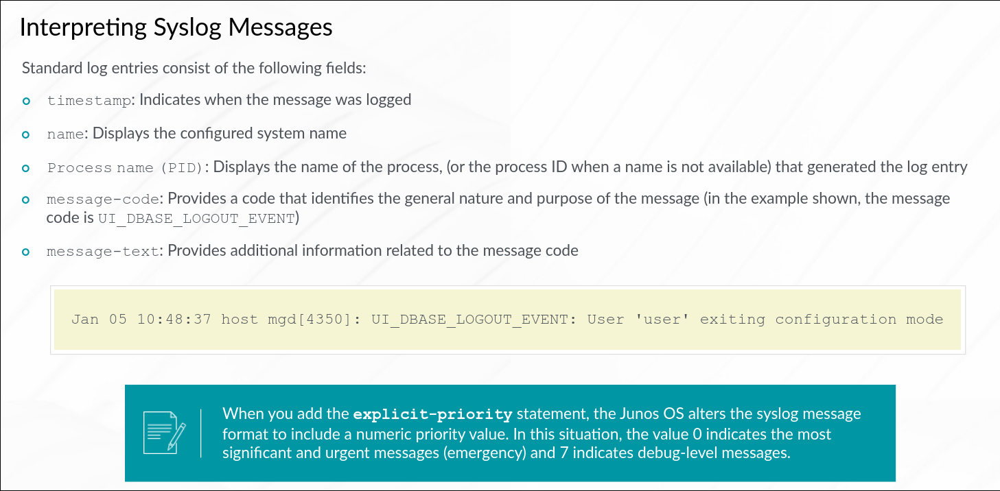
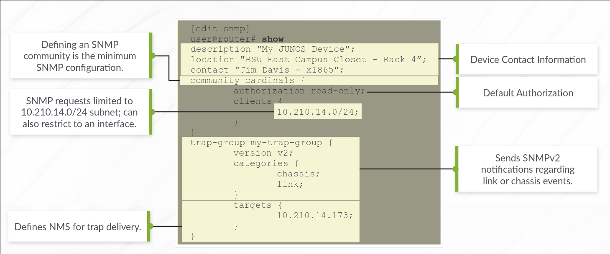

# Secondary Configuration

## User Authentication

Junos uses 3 types of authentication:

### Local Password Authentication

You configure the usernames and password locally for each user on the Junos device. Junos enforces the following password restrictions:

- At least 6 characters
- Password can contain alphanumeric characters and special characters
- Password must contain at least a change of case or a alphanumeric character

When a user is created, Junos automatically creates a directory for the user. This working directory can be changed using the operation mode command `set cli directory <directory>`

### Radius & TACACS+

These are distributed client and server systems which are used as authentication methods to validate users.

## Authentication Order

You can set the authentication order in Junos using the command `set system authentication-order [radius tacplus password]`. 

Junos will always consult the local db when it fails to reach the radius or tacplus server. However, if it gets a REJECTED reply from either the Radius or TACACS+ server, it will not consult the local db.

## Components of Authorization

Each command statement is subject to authorization. Each activity is either authorized or denied based on the component of authorization.

### Users

At the highest level, configuration of user accounts define authorization parameters. Users are members of a single login class. Remote users can be mapped to a local template.

### Class

A class is a named container which groups together a set of permission flags. There are four predefined classes to handle most situations - super-user, operator, read-only and unauthorized.

### Permissions

Permissions are predefined sets of related commands.

### Allow and Deny Overrides

These define exceptions for command statements that may allowed or denied. You can use the `deny-command`, `deny-configuration`, `allow-command` and `allow-configuration` to define regexes that match certain commands or config statements. Junos will always apply the "deny-" before the "allow-" which will result in the authorization of commands that match both.

## System Logging Overview

Junos uses the UNIX style syslog configuration syntax. The log files are stored in **/var/log** directory. Primary syslog file is stored in */var/log/messages*.

Junos supports numerous facilities and severity levels. The **facility** defines the class of the log message and **severity** determines the level of logging detail.

Junos provides local and remote logging support. Remote logging and archiving is recommended for troubleshooting.

Syslog operations can be enabled or modified in the following configuration levels:

```text
[edit system logging]

[edit routing-options options syslog]
```


## Trace (Debug)

This is the Junos equivalent of debug. It requires configuration and provides both local and remote support. The trace file is stored in the */var/log/filename* or to a remote server.

To enable remote logging, specify a remote syslog server at the **system tracing** hierarchy:

```text
[edit system tracing]
user@router# show
destination-override syslog host 1.1.1.1;
```

Due to the design of Junos OS, you can safely run trace in a production environment without significantly impacting performance. It is always advisable to turn off the trace after testing to avoid unnecessary resource utilization.

### Trace configuration

Include the traceoption command in the `[edit protocols protocol-name]` hierarchy.

```text
[edit protocols ospf]
user@router# show
traceoptions {
    file ospf-trace replace size 128k files 10 no-world-readable;
    flag event detail;
    flag error detail;
}
```
file <filename> [replace: if name exists] size <max filesize> files <number of files to be kept> [no-world-readable: only user can view]

Flags identify what aspects of the protocol are needed and their level.

By default timestamps are placed in the trace file. Add `no-stamp` to the file options to hide the timestamps.

Traceoptions are also available for other hierarchies such as `[edit interfaces interface-name]. You can check trace individual interfaces and the interface process.

### Analyzing Log and Trace Files

Use `show log` to view the stored log files and `show log file-name` to view contents of the file. Eg. `show log messages`

Use the operational mode command `help syslog <message-code>` to interpret the message codes. You can also refer the Junos documentation.

At the --more-- prompt, you can use "/" to forward search or hit "h" for context help.

Use the pipe to manipulate the output and make parsing much easier. Eg:

- `show log messages | last` to show the last lines of the log file.
- `show log messages | match "support info"`
- `show log messages | find "Apr 2 09:" | match error` to perform a logical AND search
- `show log messages | match "error|kernel|panic"` Use the quotes to evoke a logical OR search

### Miscellaneous Log File Commands

Use the `monitor start filename` to perform real-time monitoring. Ensure user has permissions to monitor.

Use the `monitor list` to find which log files are being monitored.

You can use the pipe (|) to filter files which are being monitored.

Use `monitor stop` to cease all monitoring.

## NTP

NTP is used to synchronize clocking on devices. It ensures correlated timestamps on log files for troubleshooting. Junos OS cannot provide primary time reference. It supports client, server and symmetric active modes and md5 support.

If the local device time is *off > 128ms*, the clock is slowly stepped up to be synchronized. However, if the time is *off > 1000ms* the clock is not synchronized.

```text
[edit system]
user@router# set ntp boot-server 172.25.11.254

[edit system]
user@router# set ntp server 172.25.11.254
```

Boot server is used to set up initial NTP time during boot. Operational mode `set date ntp <address>` can be used as a sub for a boot server.

Server is the configured synchronization sources

### Monitoring NTP Synchronization

`show ntp associations` to display synchronization status

`show ntp status` to view further synchronization details.

## Archiving Config FIles

Junos can be configured to automatically back up config file. This is done at the `[edit system archival]` hierarchy.

The options below can be used to backup:

- Regular backups at scheduled intervals - `transfer-interval <[15-2880]mins>`
- Backup whenever a new config is active - `transfer-on-commit`

### Monitoring the Archival Process

The transfer is logged in the /var/log/messages file - `show log messages | match transfer`. The destination filename format is fixed and cannot be changed - *host-name_juniper.conf.gz_YYYYMMDD_HHMMSS*

## SNMP

An SNMP agent communicates with an SNMP manager using different message types:

- Get, Getbulk or Getnext request - The SNMP manager requests information and the agent replies with a Get response message
- Set request - The manager changes the value of MIB object controlled by the agent. The agent returns a status in a Set response message
- Notifications - The SNMP agent sends traps to notify the manager of significant events regarding the network device. SNMPv3 uses informs to notify the manager. It is more reliable since it requires the manager to acknowledge receipt of the inform notification.

Junos supports SNMPv1, v2c and v3.

SNMPv3 has a lot of security features, provides message integrity, authentication and encryption. Junos supports Remote Monitoring (RMON) events, alarms and history. It provides user-based security (USM) model and view-based access control model (VACM)

### SNMP configuration



### Monitoring SNMP Operation

The SNMP protocol can be monitored using traceoptions, syslog and show commands. Junos can perform certain SNMP requests (walks and gets) with a show command - `show snmp mib walk jnxOperatingDescr`
