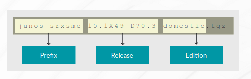

# Operational Monitoring and Maintenance

- Monitor platform and interface operations
- Use available network utilities
- Upgrade the Junos OS
- Perform password recovery
- Perform storage and system clean-up tasks

## Monitoring Tools

Junos CLI is used to monitor the device using the various operational `show` and `monitor` commands. Other tools available include:

- Junos Space
- J-Web
- SNMP
- Hardware LEDs
- Front-panel displays/LCDs

### Monitoring System-Level Operation

Use `show system` commands to monitor system-level operations. Find some common commands used:

- `show system alarms`
- `show system boot-messages`
- `show connections`
- `show system statistics`
- `show system storage`

You can always use '?' to find out the arguments available.

### Monitoring the Chassis

Use `show chassis` commands to monitor the chassis and obtain information. Find some common commands used:

- `show chassis alarms`
- `show chassis environment` - environmental status - temperatures, fan speeds
- `show chassis hardware` - displays inventory of installed hardware and their serial numbers
- `show chassis routing-engine` - operational status and utilization of RE

### Verify Interface status

Use `show interfaces <interface>` to view details of an interface. Use the '?' to view more arguments

- `show interface terse` - Quick verification of both physical and logical interfaces
- `show interfaces extensive` - View interface status, errors, stats and properties. Useful when troubleshooting

### Monitoring Interfaces

Monitor the interface usage details in real time with `monitor interface <interface name>`

Monitor real-time usage for all interfaces with `monitor interface traffic`

## Network Utilities

`Ping` and `traceroute` are used to test reachability and determine the forwarding path. They both have various arguments to assist in troubleshooting.

`Ping` sends a continuous flow of ICMP echo requests to the referenced destination and can be stopped with Ctrl+c.

You can use the *count* option with a specified number to limit the ICMP echo requests to send.

### CLI Monitor Traffic

The `monitor traffic ?` is used to monitor traffic to and from the RE.

### File

The `file copy` command is ussed to transfer files to and from Junos devices.

## Displaying Junos OS Release

`show version`

### Naming Convention

The naming convention used is: `<Prefix> <Release> <Edition>`



## Upgrading Junos

You need a valid Juniper customer account. You can download images via web browser or FTP client.

`user@router> request system software add <path/image_name>`

Example: `user@router> request system software add /var/tmp/image-name reboot`.

The */var/tmp/* is the recommended storage location if the image is copied to the local device. The `request system storage cleanup` cleans that directory. You can use the `request system storage cleanup dry-run` to determine the files that are going to be cleaned up.

Use the `show system storage` to check space before downloading an image.

The path can be a local file or a remote file. You have to reboot the device after installing the software.

You can also add the reboot option at the end of the `request system software add` command.

Use a console connection to view the details of the upgrade process when the system is rebooting or review the boot-messages after boot using `show system boot-messages`

Junos executes only signed binaries. It does not execute any binary without a registrered fingerprint. This was designed to protect the system against unauthorized software and activity that might compromise the integrity of the device.

### Unified In-Service Software Upgrade (Unified ISSU)

This enables you to:

- Upgrade between 2 different Junos releases with no distruption in the control plane.
- It eliminates downtime during the software upgrades and reduces operating costs.
- It also allows fast implementation of new features.

Unified ISSU can only be performed on devices with 2 REs. The REs must also be on the version of the OS. To perform Unified ISSU:

1. Enable Graceful Routing Engine Switchover (GRES) and Nonstop Active Routing (NSR) and make sure the REs and protocols are synchronized.
2. Download the new software package and copy to the router.
3. `request system software in-service-upgrade` on the master RE.

## Password Recovery Process

The root password can only be recovered using a console connection as a security measure. You can disable password recovery by:

```text
[edit system ports]
user@router# show
console insecure;
```

**Reboot the system**
1. Gain console access
2. Reboot the system
3. Press *spacebar* when prompted at the bootloader process.
4. Enter `boot -s` at the *loader>* prompt to boot into single-user mode.

**Enter recovery mode**
1. Enter `recovery` at the point where you are asked to enter a shell path or *Enter* for the default shell.

**Reset root password and commit**
1. When you are presented with the CLI enter configuration mode.
2. `set system root-authentication plain-text-password`
3. Enter the new password.
4. Commit

**Exit Configuration Mode**
1. Exit the configuration and operational mode.
2. Confirm system reboot.

## Storage Clean-up

This utility rotates logfiles and deletes temporary files and old software versions. This is done with `request system storage cleanup` command. It will show the list of the files to be deleted and request confirmation. You can also use the `request system storage cleanup dry-run` to view all the files to be deleted without an option to delete.

## System Clean-up for redeployment

This is to remove all configuration on the RE and returns the system to factory default configuration. It unlinks all data files by unlinking the files from their directories. This command is used in the operational mode `request system zerorize`. The files can also be made unrecoverable with `request system zerorize media`.

### Difference between load factory-default and request system zerorize media

When the `request system zerorize media` operational mode command is used, it erases all data and loads the factory default configuration. After this command, when the device is rebooted, it won't ask for a password and will have no logs.

However, the `load factory-default` will delete the current configuration and load the factory default configuration. Although you will be required to set a new root password before committing the factory default configs.

[More Info](https://kb.juniper.net/InfoCenter/index?page=content&id=KB23787)
