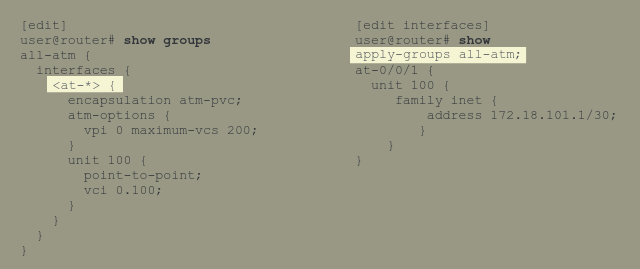

# Objectives

- Describe interface config hierarchy
- Configure various interface types
- Use configuration groups for interface-related configuration

# Interface Properties

## Physical Properties

These are properties that are defined directly under the interface name.

## Logical Properties

These are properties that are defined under a unit number.

# Creating Aggregated-Device Ethernet (ae) (Lags)

1. Create the aggregated device under the chassis hierarchy

```text
[edit]
user@router# edit chassis

[edit chassis]
user@router# set aggregated-devices ethernet device-count 1

[edit chassis]
user@router# commit
```

2. Edit the properties of the interface such as logical unit and LACP

```text
[edit interfaces ae0]
user@router# set unit 0 family ethernet-switching port-mode trunk

[edit interfaces ae0]
user@router# set aggregated-ether-options lacp passive
```

3. Add lag members by going into each interface and adding `set gigether-options 802.3ad ae0`.

```text
[edit interfaces ge-0/0/0]
user@router# set gigether-options 802.3ad ae0

[edit interfaces ge-0/0/1]
user@router# set gigether-options 802.3ad ae0
```

# Configuration Group

These enable you to create configuration statements and group them and apply this group to parts of the configuration. They are like a shortcut method of applying same parameters to many parts of a configuration. Sort of like a function in Python that you can call whenever you need it instead of rewriting the same code again.

The target area of the configuration inherits the information from the source of the configuration data.

It is configured in the `[edit groups]` hierarchy level.

It can contain wildcards to allow configuration data to be inherited by any object that matches the wildcard.


**Note:** Configuration groups are different from the other groups in the configuration such as BGP Groups. Configuration groups provide a mechanism we can use throughout the configuration but only the Junos CLI identifies.

## Displaying Inherited Configuration

Junos does not show the inherited configuration when using the just the `show` command. The inherited commands can be viewed by:

- `show interfaces at-0/0/1 | display inheritance`
- `show interfaces at-0/0/1 | display inheritance | except #`

The `except #` excludes comments related to the inherited statements.

