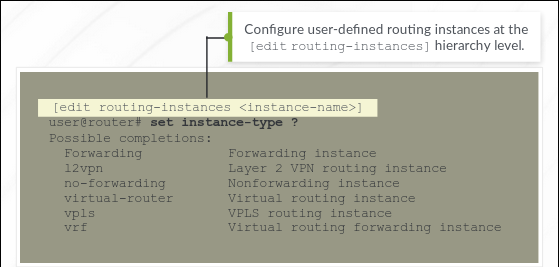
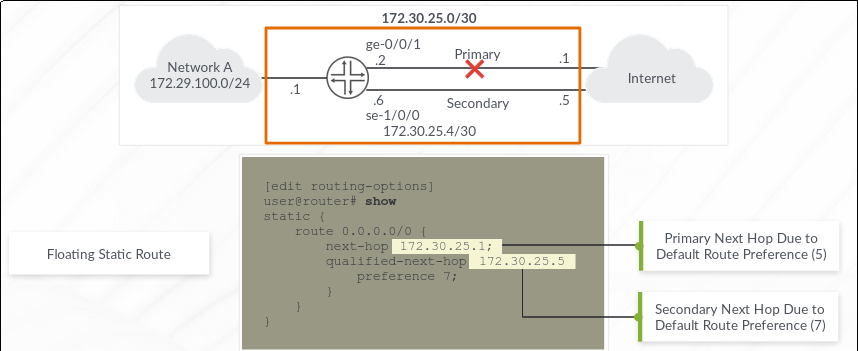

# Objectives

- Explain basic routing operations and concepts
- View and describe routing and forwarding tables
- Configure and monitor static routing
- Configure and monitor OSPF
- Configure interfaces and routing for IPv6

## Routing

Simply moving data between L3 networks.

## Components of Routing

1. **End-to-End Communication Path**: A phyical (wired/ wireless) medium needs to exist between the points trying to communicate.
2. **Routing Information on Participating L3 Devices**: The devices need to know how to reach the next device.

## Routing Table

- Compiles the information learned from routing protocols and other routing information sources - direct links and static routes.
- Selects an active route to each destination.
- Junos support equal cost routes with some configuration.
- It uses the active routes for destination prefixes to populate the Forwarding table.
- The **Forwarding Table** determines the outgoing interface and L2 rewrie information for a destination prefix.

There are multiple routing tables on Junos. The default *inet.0* is used for IPv4. There's *inet.6* for IPv6. There are other routing tables and the admin can create more.

### Route Preference

Junos uses route preference to differentiate routes. It is the primary criteria for selecting active routes.

| Routing Information Source | Default Preference |
|   -  |   -   |
| Direct | 0 |
| Local | 0 |
| Static | 5 |
| OSPF Internal | 10 |
| IS-IS L1 Internal | 15 |
| IS-IS L2 Internal | 18 |
| RIP | 100 |
| OSPF AS external | 150 |
| BGP (Both EBGP & IBGP) | 170 |
*The lower the better*

Route Preference Range: 0 - 4,294,967,295

Route preferences can be modified for each route information source but direct and local routes will always be preferred regardless of their preference.

When there are equal-cost paths for the same destination, the rpd randomly selects one of the paths to balance the load, while maintaining packet ordering in case of equal paths.

### Viewing routing table

`show route` - shows the active, holddown and hidden routes. Holddown routes are routes in pending state till the system declares them inactive.

Use the destination, protocol type and other attributes to filter the show route output. Eg. `show route protocol ospf`, `show route 10.1.43.0/30`, `show route 10.2.2.0/30 detail`

## Forwarding Table

It stores a subset of information from the routing table for the packet forwarding mechanism.

Its contents include the destination prefix and its outgoing interface.

`show route forwarding-table`

The Junos kernel always adds a default destination with type 'perm' to the forwarding table automatically. This rejects the packet and sends and ICMP destination unreachable message when there's no route for the destination and a default gateway isn't configured.

Forwarding table route types (see output of `show route forwarding-table`):

- `dest` Remote address directly reachable through an interface
- `intf` Installed as a result of configuring an interface
- `perm` Installed by the kernel during routing table initialization
- `user` Routes installed by the routing protocol or configuration

## Routing Instance

Routing Instance is a unique grouping of routing tables, interfaces and routing protocol parameters.

### Default Routing Instance

The *master* routing instance is the primary instance for Junos and it includes *inet.0* and maybe *inet.6*.

Junos also has private routing instances for internal communication between components.

`show route instance`.

### User-Defined Routing Instance

```text
[edit]
user@router# edit routing-instances <instance-name>
```



When working with routing instances, it is important to do the following:

- Reference the corresponding IP Unicast table for the instance when viewing the routing table.
    - `show route table <instance-name>.inet.0`
- Reference the routing instance name when viewing information for the instance or sourcing traffic. Examples:
    - `show interfaces terse routing-instance <instance-name>`
    - `ping 172.15.23.1 rapid count 25 routing-instance <instance-name>`
    - `traceroute 10.2.4.1 routing-instance <instance-name>`

## Static Routes

These are manually configured routes. Configured under the `edit routing-options` hierarchy.

### Next Hop

Next hop is the next router in the direction of the destination from your router. It could also be the next action for the destination prefix. Next hop is always required when configuring static routes. The next hop can be any of the following:
- A IP address - A reachable IP address using direct route. Junos does not perform recursive lookups of next hops by default. Junos will not look inside the forwarding table to lookup this IP so it must be a direct route.
- Exit interface
- Bit Bucket - this is either telling the router to reject/discard the packet. When the packet is rejected, ICMP Destination Unreachable Message is sent back to the sender whiles discard option drops the packet silently.

Static routes will remain in the routing table until they are either removed or become inactive. Static routes become inactive when the next hop is unreachable.

### Configuration

```text
[edit routing-options]
user@router# set static route 0.0.0.0/0 next-hop 172.30.25.1;
```

```text
[edit routing-options]
user@router# show
static {
    route 172.28.102.0/24 {
        next-hop 10.10.2.4;
        no-readvertise;
    }
}
```

`no-readvertise` ensures that the route isn't advertised into a routing protocol. It is recommended for static routes used for management traffic.

### Monitoring Static Routes

`show route protocol static`

Also use the `ping` utility to verify reachability.

### Next-Hop Resolution

Junos OS does not resolve next-hops by default and require next-hop addresses to be directly connected networks. However, it is possible to use an indirect next-hop by using the `resolve` command. The indirect next-hop should have an entry in the routing table either by another static route or a dynamic routing protocol.

```text
[edit routing-options]
user@router# show
static {
    route 15.15.15.6 {
        next-hop 172.25.2.6;
        resolve;
    }
}
```

### Qualified Next Hops (Floating Static Routes)

This command `qualified-next-hop <address>` is used to enable independent preference for static routes to the same destination. The `preference 7` is used after this command to change the preference of that route.



## Dynamic Routing Protocol

Benefits of Dynamic Routing Protocols:

- Lower Administrative Overhead: *The device learns the routing information automatically, which eliminates the need for manual route definitions.*
- Increased Network Availability: *The device can reroute traffic around failures automatically*
- Greater Network Scalability: *The device manages network growth easily by dynamically learning routes and calculating the best paths through the network.*

### Summary

IGPs operate within a single Autonomous System (AS). An Autonomous System is a single network administration that provides for a unique routing policy and flexible use of network resources. Examples of IGPs include RIP, OSPF and IS-IS.

EGPs operate among different ASs. They are used to communicate between independent network infrastructures. The current EGP in use today is BGP.

## OSPF

OSPF is a **link-state** protocol for use within an AS. Each router in the AS sends a *Link State Advertisement (LSA)* to its neighbors that describes the router's view of the network. These LSAs are flooded within an administrative segment called *area*. Each router gets a copy of the LSA from every router in the area and stores the information in the LSAs in a local database. The local databases are identical since they are all built from the same LSAs. This database is called *LSDB*.

OSPF uses the Dijkstra Algorithm to calculate the best path to each desination.

OSPF uses areas to incoporate hierachy and allow for scalability. The backbone area (0.0.0.0) is the main area and all areas connect to this backbone area.

### Configuring OSPF

OSPF configuration is done in the same place under the `[edit protocols ospf]` hierachy. It is important to specify the logical interface when configuring the interface. Junos will assume unit 0 if the logical unit is not stated.

Use `passive` command to prohibit adjacency formation on an interface.

```text
[edit protocols ospf]
user@router# set area 0 interface ge-0/0/0.0
user@router# set area 0 interface ge-0/0/1.0
user@router# set area 0 interface lo0.0 passive
```

Junos converts *area 0* to the dotted notation (0.0.0.0) automatically.

### Monitoring

*Verifying OSPF Neighbor State*

`show ospf neighbor`.

*Viewing OSPF Routes*

`show route protocol ospf`

## Configuring IPv6

IPv6 is already enabled on Junos OS hence no need to enable via a global command. Also, additional addresses and link-local address can be manually configured.

IPv6 is a *128-bit* address.

Recommendations:

- Use /64 for a multi-access network
- Use /127 for a pt-pt link
- Use /128 for loopbacks

```text
[edit interfaces ge-0/0/0 unit 0]
user@router# set family inet6 address xxxx:xxxx:...:xxxx/n
```

You can use only `set family inet6` command to enable IPv6 on an interface and to generate a link-local address.

Use `set family inet6 address xxxx:xxxx:...::/64 eui-64` to generate an address based on the interface's MAC address.

### Static routes for IPv6

Similar to the way IPv4 static routes are configured but the difference is that you have to specify `rib inet6.0` under the `[edit routing-options]` hierarchy.

You can use the link local address as a next hop but you have to specify the interface since the link local address is not a global address.

```text
[edit routing-options]
user@router# set rib inet6.0 static route ::/0 qualified-next-hop fe80::1 interface ge-0/0/0
```

### OSPFv3

OSPFv3 has authentication and graceful restart but maintains the core mechanisms of OSPF. However, some changes are necessary to accommodate the differences between IPv4 and IPv6.

OSPFv3 is configured the same way as OSPF, the only difference is `edit protocols ospf3`
